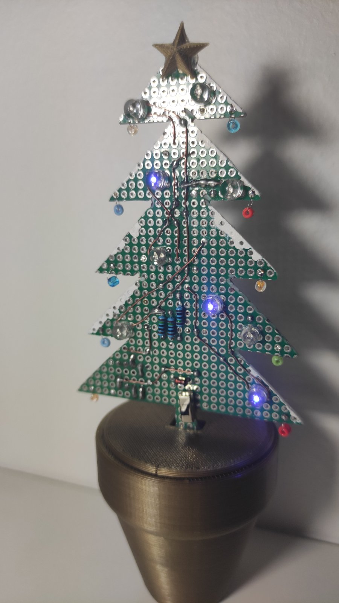

# Attiny85 Christmas Tree

This is a small christmas tree made out of green, double-sided PCB.

It has three sets of 3 LEDs (total of 9) of different colours.

An attiny85 is used as the controller running the [AttinyCore](https://github.com/SpenceKonde/ATTinyCore) bootloader so that it can have 3 PWM pins.

The whole thing is powered from a 9V battery and a Zener diode is used as a crude voltage regulator.

---

